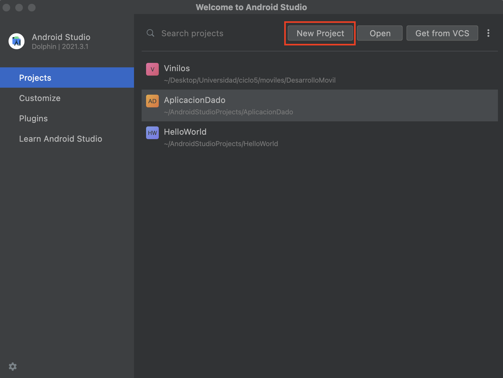
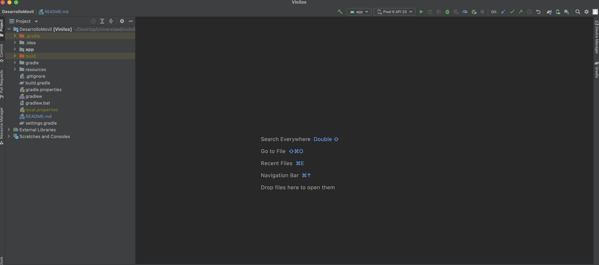
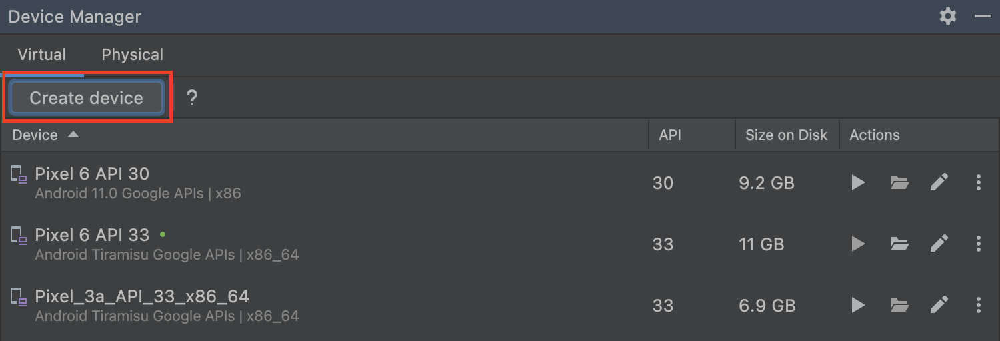
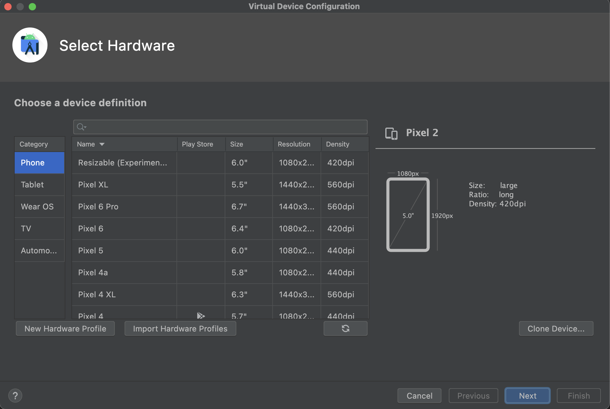
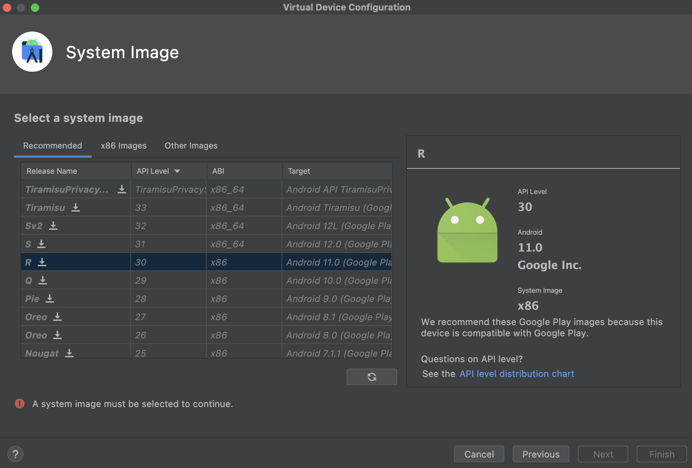

# Aplicación Móvil Vinilos

La aplicación de vinilos permitira administrar una biblioteca musical, permite la creación del album, ver la lista de albumes, asociar tracks a los albumes y ver sus detalles en este **Sprint 1**


## Requisitos 

1. Android Studio. Puede descargarlo [aquí]("https://developer.android.com/studio")
2. GIT. Puede descargar el cliente desde [aquí]("https://git-scm.com/book/en/v2/Getting-Started-Installing-Git")
3. Tener configurado uno o varios emuladores con la siguiente configuración:
    - Version de la API >= 21
    - Version de Android superior a Lollipop
    - Versiones de X64
    - Dispositivo emulado Google Pixel 3
## Ejecucion desde APK

TBD

## Ejecucion desde proyecto de Android Studio

1. Clonar repositorio
    ```bash
    git clone https://github.com/clts-uniandes/DesarrolloMovil.git
    ```
2. Abrir Android Studio
3. Abrir proyecto desde Android Studio
Debe buscar en su ordenador el directorio clonado y abrir **nuevo proyecto**

    

4. Android Studio arbira el proyecto y se mostrará de la siguiente manera:

    

5. Para ejecutar la aplicacion debe accionar el boton `Run` o `Crl + R`

     
## Configuración del Emulador

1. Ingrese a Device Manager

    

2. Creaar un nuevo dispositivo

    

3. Seleccione un dispositivo
4. Seleccione la version de Android y la API deseada

    

5. Finalmente seleccione el dispositivo creado para ejecutar la aplicación 

    