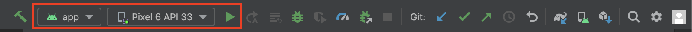

# Aplicación Móvil Vinilos

Vinilos es una aplicación móvil para coleccionistas donde puedes gestionar los álbumes y canciones de tus artistas favoritos, y premios de dichos artistas. Está entrega final incorpora listados de coleccionistas e información asociada.

## Requisitos

1. Android Studio (recomendado: Dolphin // 2021.3.1. Puede descargarlo [aquí]("https://developer.android.com/studio")
2. Git. Puede descargar el cliente desde [aquí]("https://git-scm.com/book/en/v2/Getting-Started-Installing-Git")
3. Tener configurado uno o varios emuladores con la siguiente configuración:
   - Version de la API >= 21
   - Version de Android superior a Lollipop
   - Versiones de X64
   - Dispositivo emulado: Google Pixel 3
   - Alternativamente, usar dispositivos físicos que empleen las mismas APIs (se probó con dispositivos Samsung 2016 y 2019)
   -
## Ejecucion desde APK

Descargué el APK que se encuentra en la carpeta ´apk´ e instalelo en un dispositivo Android. Un manual para ello se encuentra en: https://www.wikihow.com/Install-APK-Files-from-a-PC-on-Android

## Ejecucion desde proyecto de Android Studio (emulador)

1. Clonar repositorio
    ```bash
    git clone https://github.com/clts-uniandes/DesarrolloMovil.git
    ```
2. Abrir Android Studio
3. Abrir proyecto desde Android Studio
   Debe buscar en su ordenador el directorio clonado y abrir **nuevo proyecto**

   

4. Android Studio abrirá el proyecto y se mostrará de la siguiente manera:

   

5. Para ejecutar la aplicacion debe accionar el boton `Run` o `Crl + R`

   
## Configuración del Emulador

1. Ingrese a Device Manager

   

2. Creaar un nuevo dispositivo

   

3. Seleccione un dispositivo
4. Seleccione la versión de Android y la API deseada

   

5. Finalmente seleccione el dispositivo creado para ejecutar la aplicación

   